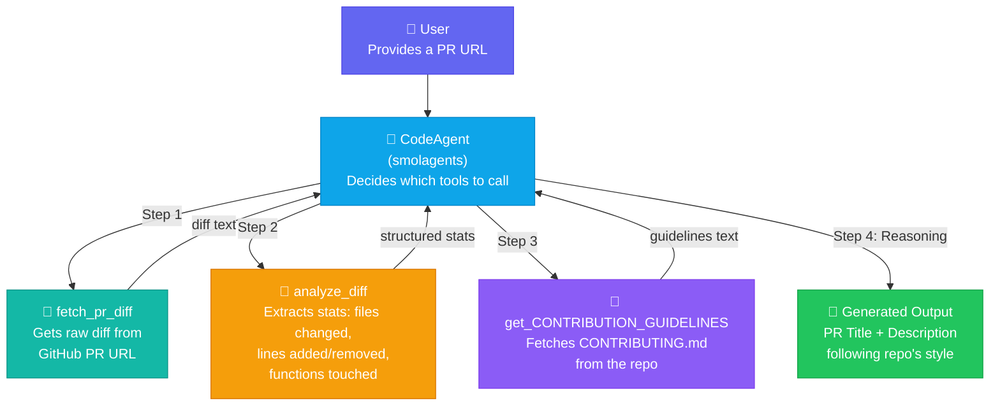

# 🤖 Agentic AI Journey

My hands-on journey into **Agentic AI** — building real agents from scratch, one phase at a time.

📖 **Blog Series:** 
- [AI Agent VS Chatbot (Phase 1)](https://dev.to/decoders_lord/ai-agent-vs-chatbot-156i)
- [Building my first AI Agent from Scratch (Phase 2)](https://dev.to/decoders_lord/building-my-first-ai-agent-from-scratch-1e35)

---

## 🚀 Projects Built During This Journey

| Project | Description | Tech |
|---------|-------------|------|
| [PR Review Agent](https://github.com/DecodersLord/PR-Review-Agent) | AI agent that analyzes GitHub PR diffs and generates review summaries | smolagents, Qwen, GitHub API |
| _More coming soon…_ | | |

---

## What I Learned (Phase by Phase)

### Phase 1 — Mental Model ✅

Built a solid mental model of what AI agents actually are and how they work. Documented everything in detailed notes.

**Key concepts covered:**
- Chatbots vs AI Agents — why LLMs changed everything
- Agent Lifecycle — Observe → Think → Plan → Act → Repeat
- Three layers of an agent — Reasoning (LLM), Action (Tools), Control (Orchestrator)

📄 [Read the notes](Phase%20-%201%20-%20Mental%20Model/notes.md)

---

### Phase 2 — Tool-Using Agents ✅

Built a **Code Analyzer Agent** from scratch — no frameworks, just Python + Google Gemini's function calling API.

**What the agent does:**
- Takes code input from the user
- Gemini decides whether to use a tool or respond directly
- Calls a local `analyze_code` tool (counts lines, functions, classes)
- Returns the analysis result

**What I learned building it:**
- LLMs are smart enough to skip your tools — system instructions guide tool usage
- Function declarations are contracts between your code and the LLM
- Dynamic tool dispatch (`available_tools[name]`) scales to multi-tool agents
- Every API call costs quota — design your agent loop to minimize round-trips

<details>
<summary>▶️ Run it yourself</summary>

```bash
cd "Phase - 2 - HuggingFace Learning to build agents/Dummy Agent v1"
pip install -r requirements.txt
echo GEMINI_AI_API=your_api_key_here > .env
python main.py
```

| Component | Technology |
|-----------|-----------|
| LLM | Google Gemini (`google-genai`) |
| Language | Python 3.10+ |
| Config | `python-dotenv` |

📁 [Explore the code](Phase%20-%202%20-%20HuggingFace%20Learning%20to%20build%20agents/Dummy%20Agent%20v1/)

</details>

---

### Phase 3 — Building PR Review agent with smolAgent ✅

For Phase 3, I transitioned to using an agentic framework ([smolagents](https://github.com/huggingface/smolagents)) to build a fully functional PR Review tool. 
Since this project is a complete application of its own, it has been extracted into a dedicated repository inside my portfolio.

🔗 **[View Full Project & Source Code →](https://github.com/DecodersLord/PR-Review-Agent)**

An AI agent that:
- 📥 Fetches GitHub PR diffs from any public repository
- 🔍 Analyzes code changes — files, hunks, functions touched, complexity
- 📋 Reads the repository's `CONTRIBUTING.md` for style guidelines
- ✍️ Generates a PR title and description matching the repo's conventions

#### Architecture



#### Tech Stack

| Component | Technology |
|-----------|-----------|
| Framework | [smolagents](https://github.com/huggingface/smolagents) (HuggingFace) |
| LLM | Qwen/Qwen2.5-Coder-32B-Instruct |
| APIs | GitHub (raw diffs, raw content) |
| Language | Python 3.8+ |

📁 [Explore the Phase 3 Folder locally](Phase%203%20-%20Building%20PR%20Review%20agent%20with%20smolAgent)

---
